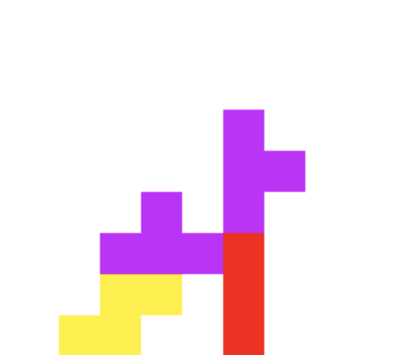
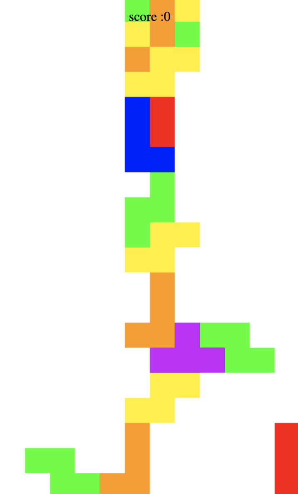
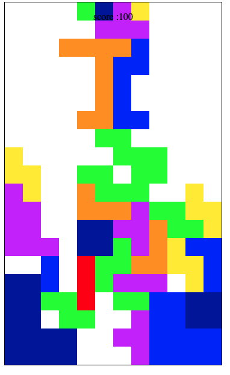
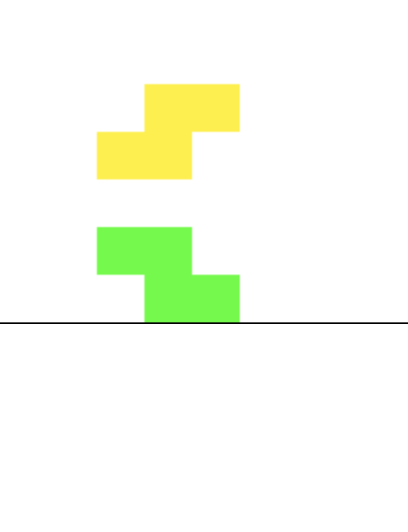
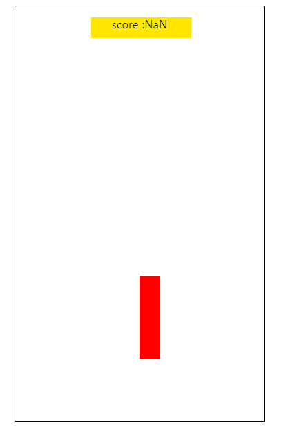
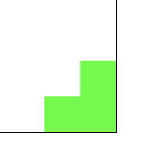
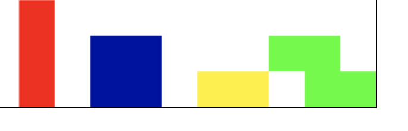

테트리스 버그 목록

## 1. I블럭을 바로 이동시 블럭 하나가 삭제되는 현상 

- 블럭 이동시 해당 I블럭이 3칸 이동하는 문제 발생

## 2. 게임이 정상적으로 종료 되지 않음 

- line이 모두 찼으나 게임이 정상적으로 종료되지 않음

## 3. 바로 이동시 블럭이 한칸 위로 올라감 

- 바로이동시 블럭이 한칸 위에서 이동하지 않음

## 4. 벽충돌 

- 벽충돌에러 발견 block(I,O)

## 5. 바로이동,아래로 이동시 바닥 충돌문제

- 바로이동시 하단에 막히지 않고 뚫고 내려가는 현상

## 6. Iblock rotate 에러

- I블럭이 회전시 하단에 1칸의 공백이 생긴후 멈춰짐.

---

# 미구현

## 게임종료 후 점수 등록 게임정지

- 게임종료후 점수등록과 게임이 정지되지 않음

## 블럭 x축 이동

- 블럭 x축으로 이동시 충돌검사를 하지않음
