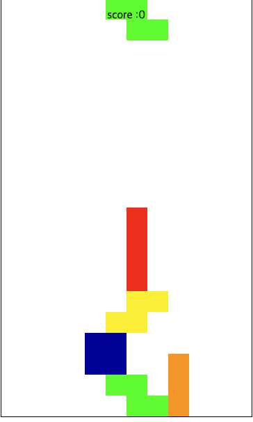
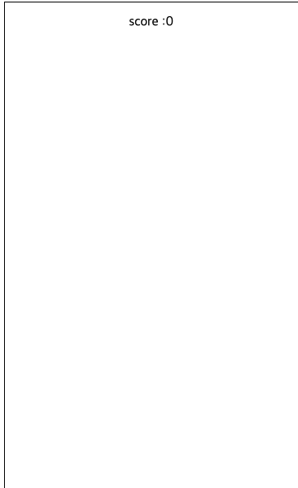
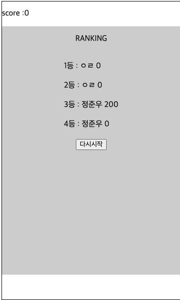

테트리스 버그 목록(version(0.0.2))

### L,J,O 블럭이 바로이동시 하단 충돌검사

- 블럭이 바로이동(direct)시 하단 블럭 충돌검사하지 않고 진행

### I,L블럭이 우측벽에서 회전시 계산하지 않고 이동

- I블럭이 좌,우측 벽에서 회전시 해당 벽에 충돌하여 밀리지 않고 그대로 넘어감

### 랭킹 등록시 해당 점수별로 저장이 아니라 등록순대로 저장.

- 랭킹 등록시 점수별로 저장되지 않고 등록순대로 저장.
